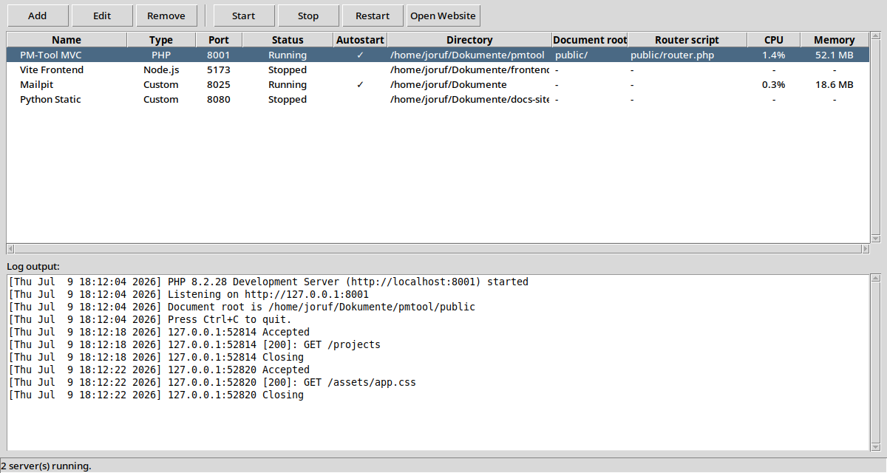
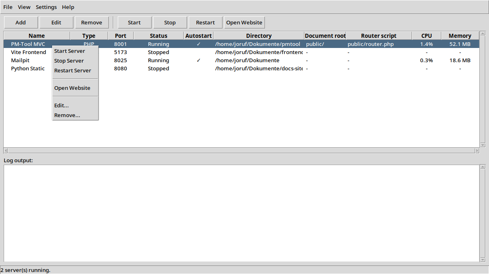
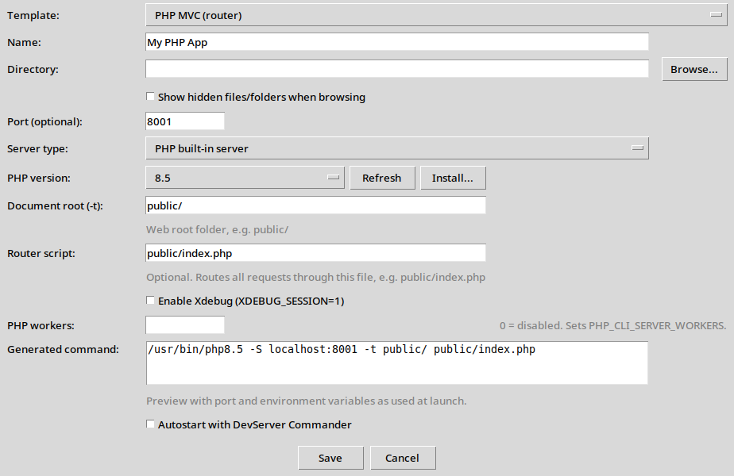
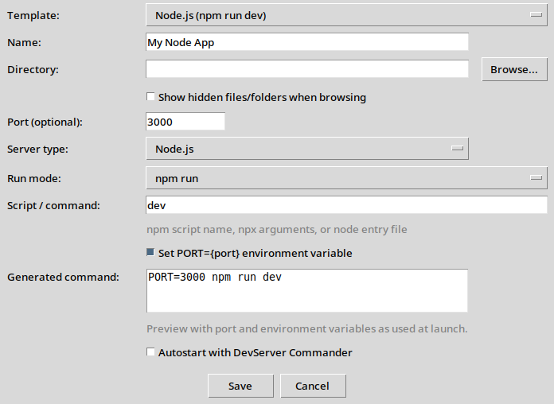
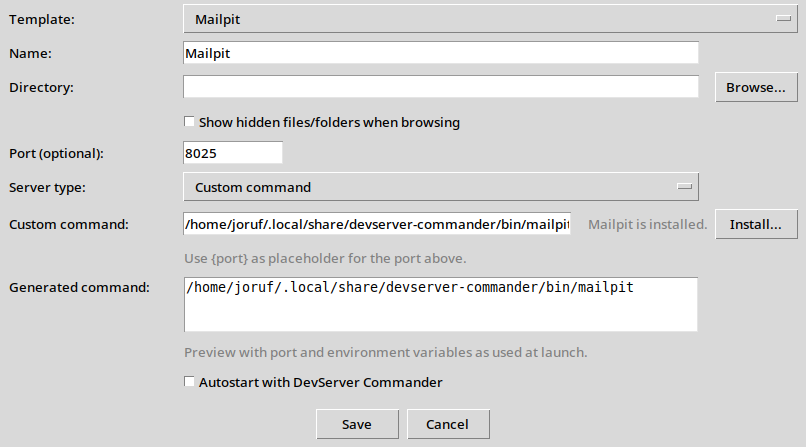
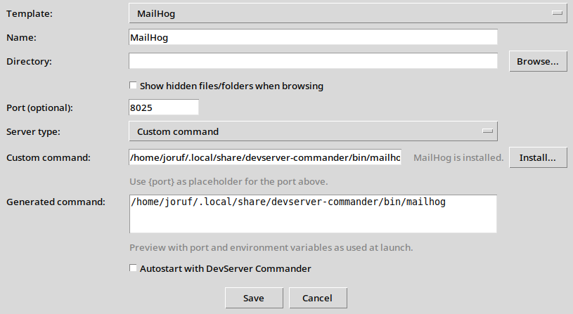
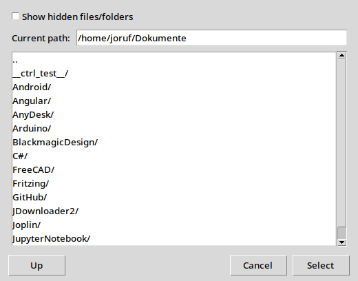
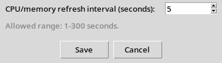

# DevServer Commander

A desktop GUI to **start, stop and restart local development servers** — PHP built-in servers, Node.js apps, Mailpit, MailHog, or any custom command — from one window instead of juggling multiple terminal tabs.

## Features

- **Server list** — add, edit and remove projects with type, port, status, autostart, paths, CPU, and memory
- **Server type column** — see at a glance whether a project is PHP, Node.js, or a custom command
- **Server templates** — quick-start presets for PHP MVC, PHP, Node.js/npm, Vite, Python, MailHog, and Mailpit
- **PHP built-in server wizard** — pick installed PHP version, document root, router script, Xdebug and worker count
- **Node.js server wizard** — configure `npm run`, `npx`, or `node` commands with optional `PORT` environment variable
- **MailHog and Mailpit installer** — download and install mail testing tools with one click (no `sudo` required)
- **PHP package installer** — install missing PHP CLI versions via `apt` from the project dialog
- **Save-time validation** — checks directories, binaries, npm scripts, ports, and router files before saving
- **Custom directory picker** — browse project folders with an optional “show hidden files/folders” toggle
- **Start / Stop / Restart** — each server runs as a managed background process in its own process group
- **Autostart** — flagged servers launch automatically when the app opens
- **Live log view** — tail stdout/stderr of the selected server in the window
- **Save visible log output** — export the currently shown log text to a `.txt` file
- **System tray** — closing the window keeps the app running in the tray; use **File → Close and Exit** or the tray menu to quit
- **Start on login** — optional autostart entry that launches the app into the system tray only, without opening the window (**Settings → Preferences**)
- **Crash notifications** — desktop notification when a server stops without being asked to, so failures are visible while the window is hidden
- **Automatic restart** — optionally restart crashed servers with a 2s / 5s / 15s backoff before giving up (**Settings → Preferences**)
- **CPU and memory columns** — see per-server resource usage in the server list (refresh interval configurable in **Settings → Preferences**)
- **Database services** — list MariaDB, MySQL, PostgreSQL, and Redis next to your servers, start and stop them via `systemctl`, and jump to their data directory
- **Dependency warning** — stopping a database service warns which development servers are still running, something a plain `systemctl` call cannot tell you
- **Context menu** — right-click a server for start, stop, restart, open website, edit, and remove
- **Edit running servers** — change configuration while a server is running; saving prompts to restart when needed
- **Port conflict details** — clear error messages with PID and process name when a port is already in use
- **Single instance** — only one application window; launching again brings the existing window to the front
- **Detects externally running servers** — shows "Running (unmanaged)" when a configured port is already in use
- **Port scanner with service names** — every listening port is named from a curated table plus `/etc/services`, so ports whose process belongs to another user (databases, DNS, CUPS) are identified instead of showing a bare dash
- **Database ports route to the service flow** — taking over a database port from the port scanner adds it as a systemd service with an auto-detected data directory, instead of a server entry that could never launch it
- **Desktop shortcut** — optional first-run prompt to create a launcher on your desktop
- **No pip dependencies** — Python standard library and tkinter only

## Screenshots

### Main window

Server list with type, status, CPU/memory usage, and live log output for the selected project.



### Context menu

Right-click a server for quick start, stop, restart, open website, edit, and remove actions.



### Add project — PHP template

Configure PHP version, document root, router script, Xdebug, workers, and preview the generated start command.



### Add project — Node.js template

Configure npm, npx, or node commands with optional `PORT` environment variable substitution.



### Add project — Mailpit / MailHog

Use the Mailpit or MailHog template and install the binary directly from the dialog when it is missing.





### Directory picker

Choose a working directory with an optional hidden-files toggle when browsing folders.



### Preferences

Configure how often CPU and memory values are refreshed in the server list, whether crashed servers
are reported and restarted, and whether the app starts into the system tray on login.



## Requirements

- Linux
- Python 3.10+ with tkinter (usually pre-installed; on Debian/Ubuntu: `sudo apt install python3-tk`)
- `fuser` from `psmisc` (used to stop servers that were not started by DevServer Commander; on Debian/Ubuntu: `sudo apt install psmisc`)
- Optional: GTK3 Python bindings for the system tray (on Debian/Ubuntu: `sudo apt install gir1.2-gtk-3.0`)
- Optional: `notify-send` from `libnotify-bin` for crash notifications (on Debian/Ubuntu: `sudo apt install libnotify-bin`)
- Optional: ImageMagick `import` and `scrot` (only needed to regenerate README screenshots)

## Installation & Usage

```bash
git clone https://github.com/joruf/devserver-commander.git
cd devserver-commander
chmod +x run.py installer.py
python3 installer.py
./run.py
```

On first start you are asked once whether to create a desktop shortcut. You can also create it from **Help → Create Desktop Shortcut...**.

The installer checks Python, tkinter, and `fuser`, and sets the executable bit on the main script if needed.

### Command-line options

| Option | Effect |
|--------|--------|
| `--tray` (aliases: `--minimized`, `--hidden`) | Start without opening the main window — the app is only present in the system tray. Autostart-flagged servers still start, and the window opens from the tray icon or by launching the app again. |
| `-h`, `--help` | Show all available options |

### Start on login

Enable **Settings → Preferences... → Start DevServer Commander on login** to install
`~/.config/autostart/devserver-commander.desktop`. That entry launches the app with `--tray`, so at
login it appears in the system tray only, starts the autostart-flagged servers in the background, and
never pops up a window. Unchecking the option removes the entry again.

A `--tray` launch while another instance is already running exits silently instead of showing the
"already running" dialog, so a duplicate login autostart never interrupts you.

If GTK3 bindings are missing, tray support is unavailable; `--tray` then falls back to showing the
window so the app cannot become unreachable.

### Crash notifications and automatic restart

Every two seconds the app checks whether a managed server ended without a stop request. Such an exit
is written into the server's log file (`--- exited unexpectedly: ended with exit code 7 ---`), shown
in the status bar, and — with **Notify when a server stops unexpectedly** enabled (default) — sent as
a desktop notification via `notify-send`. That matters most in tray-only operation, where a dead
server would otherwise go unnoticed.

With **Restart crashed servers automatically** enabled, the server is restarted after 2s, then 5s,
then 15s. If it keeps crashing, the app gives up and says so instead of looping forever. A server
that stays up for 60 seconds counts as healthy again and gets the full set of attempts next time.
Starting, stopping or restarting a server yourself cancels any pending automatic restart, and both
notifications and restarts stay silent about servers you started outside the app
("Running (unmanaged)").

The tray tooltip shows how many of the configured servers are currently running.

## Project structure

```
devserver-commander/
├── run.py                          # Application entry point; starts the GUI
├── installer.py                    # Checks Python, tkinter, fuser, and GTK3; sets executable permissions
├── paths.py                        # Central path constants for config, icons, desktop files, and resources
├── servers.json                    # User-defined server list persisted as JSON
├── README.md                       # Project documentation
├── LICENSE                         # License terms
├── .gitignore                      # Git ignore rules for local and generated files
├── .gitattributes                  # Git line-ending and file attribute rules
│
├── config/                         # Configuration loading, validation, and app preferences
│   ├── __init__.py                 # Public exports for the config package
│   ├── manager.py                  # Loads and saves the server and service lists from servers.json
│   ├── validation.py               # Validates ports, document roots, router scripts, and launch commands
│   ├── app_settings.py             # Loads and saves user preferences (e.g. stats refresh interval)
│   └── presets.py                  # Built-in server templates for the add-project dialog
│
├── models/                         # Data structures used across the application
│   ├── __init__.py                 # Public exports for the models package
│   ├── server_project.py           # ServerProject dataclass: name, directory, command, port, env, autostart
│   └── system_service.py           # SystemService dataclass: name, systemd unit, port, data directory
│
├── services/                       # Business logic without UI dependencies
│   ├── __init__.py                 # Public exports for the services package
│   ├── process.py                  # Starts, stops, restarts processes; detects crashes; manages log file paths
│   ├── php.py                      # PHP version detection, command building, and install helpers
│   ├── node.py                     # Node.js command building and npm/npx/node detection helpers
│   ├── server_types.py             # Detects whether a stored command is PHP, Node.js, or custom
│   ├── systemd.py                  # Reads unit state and runs start/stop/restart with polkit authorization
│   ├── service_catalog.py          # Closed catalog of supported database services and data directory detection
│   ├── dev_tools.py                # One-click download/install helpers for MailHog and Mailpit
│   ├── well_known_ports.py         # Names the service behind a port via curated table and /etc/services
│   ├── stats.py                    # CPU and memory usage via /proc; port-to-PID lookup
│   ├── notifications.py            # Desktop notifications via notify-send for events behind a hidden window
│   ├── port_info.py                # Describes which process is using a TCP port
│   ├── ports.py                    # Low-level TCP port availability checks
│   ├── single_instance.py          # Prevents multiple application instances from running
│   ├── instance_ipc.py             # Unix socket used to raise the existing window on relaunch
│   └── cli_args.py                 # Parses command-line options such as --tray for the login autostart
│
├── ui/                             # Tkinter windows, dialogs, and desktop integration
│   ├── __init__.py                 # Public exports for the UI package
│   ├── main_window.py              # Main window: server list, toolbar, log view, menus, polling
│   ├── project_dialog.py           # Add/Edit dialog for PHP, Node.js, and custom server commands
│   ├── service_dialog.py           # Add dialog listing detected database services from the catalog
│   ├── directory_picker.py         # Custom directory chooser with hidden-folder support
│   ├── preferences_dialog.py     # Preferences dialog for application-wide settings
│   ├── desktop_setup.py            # First-run prompt, desktop shortcut creation, and login autostart entry
│   ├── window_icon.py              # Applies the application icon to windows and dialogs
│   ├── tray.py                     # GTK3 system tray icon with show and exit actions
│   └── startup_notify.py           # Clears the desktop busy cursor after launch
│
├── scripts/                        # Maintenance helpers
│   └── generate_screenshots.py     # Regenerates README screenshots from the live UI
│
├── resources/                      # Static assets shipped with the application
│   ├── devserver-commander.desktop # Template for the Linux desktop launcher
│   └── devserver-commander.png     # Application icon for window, tray, and desktop shortcut
│
└── docs/                           # Documentation assets
    └── screenshots/                # README screenshots
        ├── main-window.png         # Main application window
        ├── context-menu.png        # Server list context menu
        ├── project-dialog-php.png  # Add project dialog with PHP template
        ├── project-dialog-node.png # Add project dialog with Node.js template
        ├── project-dialog-mailpit.png
        ├── project-dialog-mailhog.png
        ├── directory-picker.png    # Directory chooser dialog
        └── preferences.png         # Preferences dialog
```

### Runtime files (not in the repository)

| Path | Purpose |
|------|---------|
| `~/.config/devserver-commander/settings.json` | Persisted application preferences |
| `~/.config/autostart/devserver-commander.desktop` | Login autostart entry; launches the app with `--tray` (only present while "Start on login" is enabled) |
| `~/.local/state/devserver-commander/logs/` | Per-server stdout/stderr log files |
| `~/.local/state/devserver-commander/instance.lock` | Single-instance lock file while the app is running |
| `~/.local/state/devserver-commander/control.sock` | Control socket used to raise the existing window on relaunch |
| `~/.local/share/devserver-commander/bin/` | Downloaded MailHog and Mailpit binaries |
| `.initialized` | Marker file in the project root; skips the first-run desktop shortcut prompt |

## Configuration

All servers are stored in `servers.json` in the project directory:

```json
{
  "servers": [
    {
      "name": "My App",
      "directory": "/path/to/project",
      "command": "/usr/bin/php8.4 -S localhost:{port} -t public/ public/index.php",
      "port": 8001,
      "env": {
        "XDEBUG_SESSION": "1",
        "PHP_CLI_SERVER_WORKERS": "6"
      },
      "autostart": false
    }
  ],
  "services": [
    {
      "name": "MariaDB",
      "unit": "mariadb.service",
      "port": 3306,
      "data_directory": "/var/lib/mysql"
    }
  ]
}
```

- `{port}` in the command is replaced with the configured port number
- `-t public/` sets the document root (web root folder)
- `public/index.php` is an optional router script that handles all requests
- `PHP_CLI_SERVER_WORKERS` is omitted when set to `0` in the GUI
- `services` entries are only loaded when their unit is part of the catalog, so a hand-edited file cannot add arbitrary systemd units

Log files are written to `~/.local/state/devserver-commander/logs/` and persist even when the GUI is closed.

Application preferences live separately in `$XDG_CONFIG_HOME/devserver-commander/settings.json`
(`~/.config/...` by default) and are written by **Settings → Preferences...**:

```json
{
  "stats_refresh_interval_seconds": 5,
  "notify_on_server_crash": true,
  "restart_crashed_servers": false
}
```

Keys missing from an older file fall back to these defaults.

## Server templates

When adding a project, choose a template to pre-fill the dialog:

| Template | Type | Typical port |
|----------|------|--------------|
| PHP MVC (router) | PHP | 8001 |
| PHP (document root only) | PHP | 8002 |
| Node.js (npm run dev) | Node.js | 3000 |
| Vite (npx) | Node.js | 5173 |
| Python HTTP server | Custom | 8080 |
| MailHog | Custom | 8025 |
| Mailpit | Custom | 8025 |

MailHog and Mailpit are installed to `~/.local/share/devserver-commander/bin/` when you click **Install...** in the project dialog.

## Database services

Your projects usually share one database server. Unlike a development server, it is
not a per-project child process: it is system-wide infrastructure owned by systemd,
running as its own user. It therefore gets its own entry type instead of being
squeezed into a server entry.

Click **Add Service...** to list the supported services that are installed on this
machine:

| Service | Units detected | Port | Default data directory |
|---------|----------------|------|------------------------|
| MariaDB | `mariadb.service` | 3306 | `/var/lib/mysql` |
| MySQL | `mysql.service`, `mysqld.service` | 3306 | `/var/lib/mysql` |
| PostgreSQL | `postgresql.service` | 5432 | `/var/lib/postgresql` |
| Redis | `redis-server.service`, `redis.service` | 6379 | `/var/lib/redis` |

Units that alias one another collapse into a single entry, and the data directory is
read from the service's own configuration (`datadir`, `data_directory`, `dir`) with
the packaging default as fallback. The resolved path is shown in the **Directory**
column, and **Open Data Directory** — visible only while a service row is selected —
opens it in your file manager.

Start, stop and restart run through `systemctl`. Authorization is requested through
your desktop's polkit agent, falling back to `pkexec`; nothing is elevated
permanently and no `sudo` rule is needed. Stopping a service while development
servers are running asks for confirmation first and lists them by name.

**Deliberate limits.** This is a development-server manager, not a systemd front end:

- The service list is a closed catalog — there is no field for arbitrary unit names, and entries outside the catalog are dropped when reading `servers.json`
- Boot behavior stays with systemd: the app never runs `enable` or `disable`, so there is no second source of truth. Service rows have no autostart checkbox, and the app does not start services when it launches
- No log viewer, config editor, or backup features — use `journalctl` and your database tools for those

## Port scanner

**View → Port Scanner...** lists every listening TCP port that is not already in the
server list, including the ports of configured services.

`ss -p` only reveals process details for sockets belonging to the calling user. A
database listening as its own system user therefore shows no process name — the
column stays a dash, which used to leave the row unidentified. The **Service** column
fills that gap: it names the service conventionally reachable on that port, first from
a curated table (readable names plus development tooling such as Vite, Mailpit, and
Ollama), then from `/etc/services` for the several hundred registered names shipped
with the system.

Selecting a row explains the rest in the status line: the process and PID when they are
readable, otherwise the user account owning the socket, read from `/proc/net/tcp`. A
name derived from the port number is a convention, not proof of what is running, so the
**Process** column keeps reporting only what `ss` actually observed.

The same naming appears in port conflict messages, so configuring a port that a
database already occupies says which service it is.

### Taking over a database port

**Add to Server List...** on a database port offers the service flow instead. A server
entry would be a dead end there: the process runs under systemd as its own user, so
this application could neither launch nor stop it.

Two things follow from that, and both remove work rather than adding a field to fill in:

- A service needs **no launch directory and no command at all**. `SystemService` stores
  only name, unit, port, and data directory
- The data directory is **detected automatically** from the service's own configuration,
  so nothing has to be typed

The process working directory, by the way, cannot be read for a service:
`/proc/<pid>/cwd` is only readable by the process owner or root, and the units do not
set `WorkingDirectory=`. That is why the data directory is resolved from the
configuration instead. Declining the offer still opens the normal server dialog.

## Usage tips

| Action | How |
|--------|-----|
| Add server | **Add** button, then choose a **Template** preset |
| Add database service | **Add Service...** button, then pick a detected service |
| Edit server | Select entry, then **Edit**, double-click, or right-click **Edit...** |
| Start / stop / restart | Toolbar buttons or right-click context menu |
| Open website | **Open Website** button or right-click context menu |
| Open a service's data directory | Select the service, then **Open Data Directory** or double-click the row |
| Save visible log | **View → Save Visible Log Output...** |
| Hide to tray | Close the window or **File → Close** |
| Quit completely | **File → Close and Exit** or tray menu **Exit** |
| CPU/memory refresh | **Settings → Preferences...** |
| Start on login (tray only) | **Settings → Preferences...**, enable **Start DevServer Commander on login** |
| Start into the tray manually | `./run.py --tray` |
| Crash notifications / auto-restart | **Settings → Preferences...** |
| Install PHP | In the project dialog: **Install...** next to the PHP version dropdown |
| Install MailHog / Mailpit | In the project dialog: **Install...** next to the custom command field |
| Browse with hidden folders | **Browse...** in the project dialog, then enable the checkbox |

Edit and Remove are disabled until a server is selected. Running servers can be edited; saving while a server is running asks whether to restart it. Remove still requires the server to be stopped first.

Service rows behave differently: they cannot be edited (the catalog defines them) and have no website. Removing a service only takes it off the list — the systemd unit keeps running and its boot behavior stays unchanged.

## Regenerating screenshots

If you change the UI and want to refresh the README images:

```bash
python3 scripts/generate_screenshots.py
```

Requires a running X11 desktop session plus `import` (ImageMagick) and `scrot`.

## Testing

```bash
python3 -m unittest discover -s tests -v
```

CI runs the unit suite on Ubuntu 22.04/24.04 (Python 3.11 and 3.12) on every push and
pull request. **Windows is not supported** for this Linux desktop tool, so CI has no
`windows-latest` job.

The service tests never call `systemctl`: unit states are faked, so the suite reports the
same result whether or not a database is installed. The main-window tests need a display
and skip themselves automatically when Tk cannot open one.

### Multi-OS matrix (local Linux host)

```bash
~/os-test-matrix/bin/test-project /path/to/devserver-commander
~/os-test-matrix/bin/test-project "$PWD" --only ubuntu-2404
```

On-demand Linux runners: [`OS Matrix`](.github/workflows/os-matrix.yml).
Results: `~/os-test-matrix/results/`.

## License

See [LICENSE](LICENSE).
